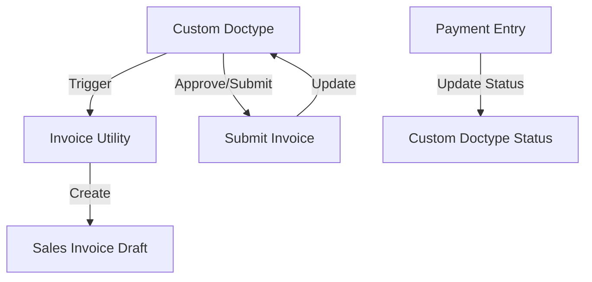

# 📘 Panduan Integrasi Koperasi (Kopmp) & ERPNext Invoice
**Dokumentasi Teknis untuk Developer**

Panduan ini mendokumentasikan pola integrasi yang digunakan pada modul **Pinjaman (Loan)** agar dapat direplikasi untuk modul **SHU (Sisa Hasil Usaha)**.

---

## 🏗️ Pola Arsitektur (Architecture Pattern)

Integrasi ini menghubungkan **Custom App (`kopmp`)** dengan **ERPNext Accounting** tanpa mengubah core ERPNext.

### Alur Data (Data Flow)


### Komponen Utama
1.  **Utility Script (`invoice.py`)**: Sentralisasi logic pembuatan invoice.
2.  **Hooks (`hooks.py`)**: Menangkap event pembayaran ERPNext.
3.  **Setup Script**: Membuat Item & Akun otomatis.

---

## 🚀 Langkah Implementasi untuk SHU

Untuk membuat sistem Invoice SHU yang mirip dengan Pinjaman, ikuti langkah berikut:

### 1. Setup Master Data (`setup_shu.py`)
Jangan hardcode Item atau Akun. Buat script untuk auto-create saat app di-install.

```python
# Contoh: Membuat Item Jasa untuk SHU
def create_shu_item():
    if not frappe.db.exists("Item", "SHU-DIST"):
        item = frappe.new_doc("Item")
        item.item_code = "SHU-DIST"
        item.item_name = "Distribusi SHU"
        item.is_sales_item = 1
        item.insert()
```

### 2. Utility Manager Nasabah (`customer.py`)
Pastikan setiap Anggota Koperasi punya data `Customer` di ERPNext. Gunakan pola `get_or_create_customer`:

```python
def get_or_create_customer(user_profile_id):
    # Cek apakah Customer sudah ada
    # Jika tidak, buat Customer baru dengan nama Profile
    # Mapping: User Profile -> Customer
```

### 3. Logic Pembuatan Invoice (`invoice_shu.py`)
Buat fungsi khusus untuk generate invoice SHU.

**Pola Penting:**
*   Invoice dibuat saat **Draft/Calculation**.
*   Status Invoice tetap **Draft** sampai SHU disetujui.
*   **Income Account** bisa diarahkan ke akun "Hutang SHU" atau "Biaya SHU" (tergantung akuntansi).

```python
def create_shu_invoice(shu_doc):
    invoice = frappe.new_doc("Sales Invoice")
    invoice.customer = get_or_create_customer(shu_doc.member_id)
    invoice.items = [{
        "item_code": "SHU-DIST",
        "rate": shu_doc.total_shu,
        "income_account": "Hutang SHU Anggota" # Sesuaikan akun
    }]
    invoice.insert() # Draft dulu
    return invoice.name
```

### 4. Trigger di Doctype (`shu_distribution.py`)
Panggil utility tadi saat dokumen dibuat atau disubmit.

```python
class SHUDistribution(Document):
    def after_insert(self):
        # Buat invoice draft otomatis
        create_shu_invoice(self)

    def on_submit(self):
        # Submit invoice saat SHU disetujui
        if self.invoice_id:
            inv = frappe.get_doc("Sales Invoice", self.invoice_id)
            inv.submit()
            
            # (Opsional) Langsung mark as Paid jika potong saldo
            inv.db_set('status', 'Paid')
```

### 5. Update Status Balik (`payment.py` & `hooks.py`)
Jika Rapat Anggota memutuskan SHU dibayar tunai (via Payment Entry):

**Di `hooks.py`:**
```python
doc_events = {
    "Payment Entry": {
        "on_submit": "kopmp.utils.payment.update_shu_status"
    }
}
```

**Di `payment.py`:**
Cek apakah Payment Entry membayar Invoice SHU, lalu update status dokumen SHU menjadi "Paid".

---

## 💡 Tips Penting (Best Practices)

1.  **Gunakan Custom Fields**: Tambahkan field `custom_shu_id` di Sales Invoice agar mudah melacak balik (link).
2.  **Jangan Hardcode Akun**: Gunakan `frappe.db.get_single_value` atau settings untuk menentukan akun default (jangan "4000 - Sales").
3.  **UI Feedback**: Jika Invoice sudah "Paid" tapi ERPNext bilang "Unpaid" (karena accounting), gunakan `frappe.msgprint` atau label status kustom untuk menenangkan user.
4.  **Admin Fee Terpisah**: Jika ada biaya admin, buat sebagai Item terpisah di Invoice (`SHU-ADMIN-FEE`) agar transparan.

---

## 📂 Struktur File yang Disarankan
```
apps/kopmp/kopmp/
├── shumanagement/              # Modul SHU
│   ├── doctype/
│   │   └── shu_distribution/   # Doctype Utama
├── utils/
│   ├── invoice_shu.py          # Logic Invoice khusus SHU
│   ├── customer.py             # Reuse logic Customer yang sudah ada
│   └── payment.py              # Logic update status
```

Semoga panduan ini membantu teman Anda membangun modul SHU! 🚀
